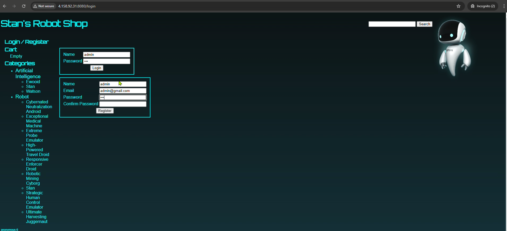
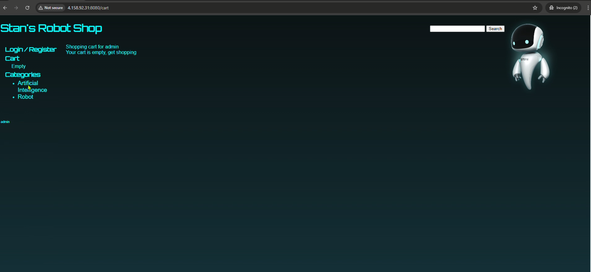
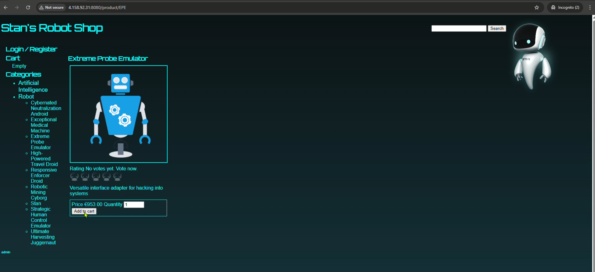
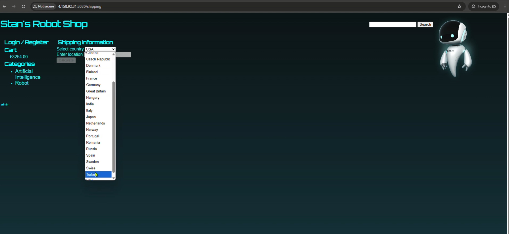
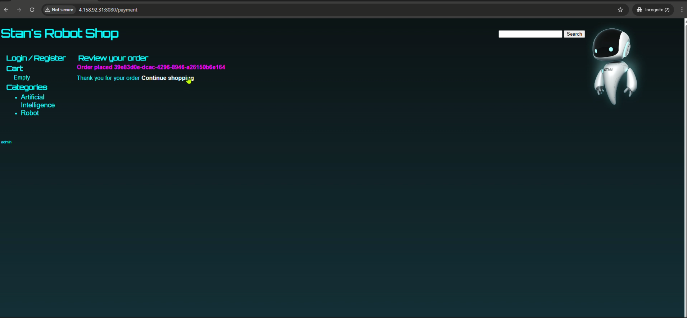

# **Ecommerce Demo in Azure**

In this project, I am hosting an ecommerce application in Azure Kubernetes Service (AKS). I am using the [**Instana/robot-shop**](https://github.com/instana/robot-shop) repository to get the source code and create containers from it.

## **Steps to Follow**

### **1. Create an Azure Kubernetes Cluster and Connect to It**
```bash
az aks get-credentials --resource-group robotshop --name robotshop
```

### **2. Create a Namespace for Robot-Shop**
```bash
kubectl create namespace robot-shop
```

### **3. Deploy the Helm Charts to the Kubernetes Cluster**
```bash
cd helm
helm install robot-shop --namespace robot-shop . 
kubectl get all -n robot-shop
```

### **4. Update Redis Persistent Volume Claim**
The default Redis deployment uses a `standard` storage class, which is commonly used in AWS. However, in Azure, we need to use the `default` storage class instead.

- Check available storage classes:
```bash
kubectl get storageclass
```
- Delete the existing Persistent Volume Claim (PVC):
```bash
kubectl delete pvc -n robot-shop data-redis-0
```
- Create a Persistent Volume (PV) and Persistent Volume Claim (PVC) using the `default` storage class:
```bash
kubectl apply -f pv.yml -n robot-shop
kubectl apply -f pvc.yml -n robot-shop
```

### **5. Verify All Pods Are Running**
```bash
kubectl get pods -n robot-shop
```

### **6. Get the LoadBalancer Endpoint**
Ensure that incoming traffic is allowed in the network settings.
```bash
kubectl get svc -n robot-shop
```
- Copy the `EXTERNAL-IP` of the LoadBalancer and access the application via a web browser.

### **7. Access the Application**
Once deployed, you can access the application using the LoadBalancer IP.

---
## **Troubleshooting**

### **PVC Stuck in Pending State**
- If the Persistent Volume Claim remains in `Pending` status, ensure that the correct storage class is being used.
```bash
kubectl get pvc -n robot-shop
kubectl describe pvc data-redis-0 -n robot-shop
```
- If necessary, delete and recreate the PVC as shown in Step 4.

### **Helm Deployment Fails**
- Check the Helm release status:
```bash
helm list -n robot-shop
```
- View logs for troubleshooting:
```bash
kubectl logs -l app=robot-shop -n robot-shop
```

---
## **Images**

### **Microservices Overview**

**Login Micro Service:**  


**Cart Micro Service:**  


**Products Micro Service:**  


**Shipping Micro Service:**  


**Payment Micro Service:**  



